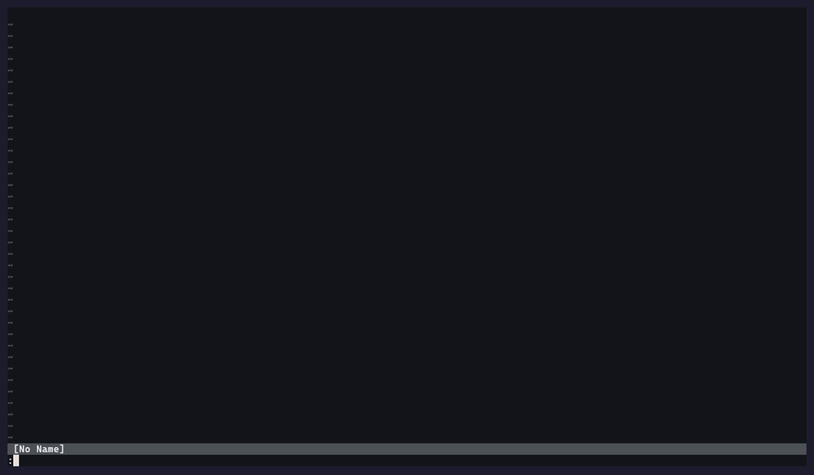

# review.nvim 🧐

Code review annotations for codediff.nvim, optimized for AI feedback loops.

Inspired by [tuicr](https://github.com/agavra/tuicr).



## Features

- Add comments to specific lines in diff view (Note, Suggestion, Issue, Praise)
- Multi-line comment support with box-style virtual text display
- Comments displayed as signs, line highlights, and virtual text
- One comment store per repository, persisted across restarts
- Closing the review exports to the clipboard, then archives and clears the comments
- Export format optimized for AI conversations
- Send comments directly to [sidekick.nvim](https://github.com/folke/sidekick.nvim) for AI chat
- Commit picker modal to select specific commits to review
- Branch picker to review a branch against its base (merge-base aware, no checkout needed)
- Notes on any file while you browse, exported alongside review comments
- Built on top of codediff.nvim

## Requirements

- Neovim >= 0.9
- [codediff.nvim](https://github.com/esmuellert/codediff.nvim)
- [nui.nvim](https://github.com/MunifTanjim/nui.nvim)

## Installation

This plugin uses [semantic versioning](https://semver.org/). Pin to a tag to avoid breaking changes.

Using lazy.nvim:

```lua
{
  "georgeguimaraes/review.nvim",
  version = "v*",
  dependencies = {
    "esmuellert/codediff.nvim",
    "MunifTanjim/nui.nvim",
  },
  cmd = { "Review" },
  keys = {
    { "<leader>r", "<cmd>Review<cr>", desc = "Review" },
    { "<leader>R", "<cmd>Review commits<cr>", desc = "Review commits" },
  },
  opts = {},
}
```

## Usage

```vim
:Review              " Open codediff with comment keymaps (default)
:Review open         " Same as above
:Review commits      " Select commits to review (picker modal)
:Review commits SHA  " Review a single commit (diffs SHA^ against SHA)
:Review commits REV1 REV2  " Review specific revision range (skips picker)
:Review branch       " Pick a branch to review against main/master (current branch first)
:Review branch TARGET [BASE]  " Review TARGET (e.g. origin/feature) against BASE (skips picker)
:Review note         " Comment on the current line of any file (:'<,'>Review note for a range)
:Review edit         " Edit the comment at the cursor
:Review delete       " Delete the comment at the cursor
:Review close        " Close: export to clipboard, then archive and clear comments
:Review export       " Export comments to clipboard
:Review preview      " Preview exported markdown in split
:Review sidekick     " Send comments to sidekick.nvim
:Review list         " List all comments
:Review clear        " Clear all comments
:Review toggle       " Toggle readonly/edit mode
```

## Export targets

Every export (`C`, `:Review export`, and `q` on close) copies the markdown to the clipboard and calls `export.on_export` if you set one. That's the hook for anything that isn't the clipboard: a tmux pane, a file an agent watches, Avante, whatever you use.

```lua
require("review").setup({
  export = {
    clipboard = true,
    on_export = function(markdown, comments)
      -- send it to the pane on the right
      vim.fn.system({ "tmux", "send-keys", "-t", "right", markdown, "Enter" })
    end,
  },
})
```

`comments` is the list of comment tables (`file`, `line`, `line_end`, `side`, `type`, `text`), in case you'd rather build your own format.

Run `:checkhealth review` to confirm codediff.nvim, nui.nvim, git and the clipboard are all in place. It also checks the codediff API surface review.nvim depends on, so it catches version mismatches between the two plugins.

## Workflow

Open a review with `:Review` to see your staged and unstaged changes in a side-by-side diff, or `:Review commits` if you want to pick specific commits to review. For a whole branch, `:Review branch` lists branches to review with the one you're on first. Reviewing the current branch diffs the merge base with your working tree, so uncommitted work is included; reviewing any other branch (say `origin/feature-x`) diffs commits without checking it out. The base is `main` or `master` unless you set `branch = { base = "develop" }` or pass it as the second argument. Comments are stored per base/branch pair and survive new commits. The diff opens in a new tab with a file panel on the left.

Navigate between files with `<Tab>` and `<S-Tab>`. Toggle the file panel with `f`. Press `t` to toggle between side-by-side and inline layout. Switch between the old (left) and new (right) panes with `<C-w>h` and `<C-w>l`. When you spot something worth commenting on, press `i` on the line and pick a comment type from the menu (note, suggestion, issue, praise). The comment renders inline as a box below the line with a sign icon in the gutter.

For multi-line comments, visually select the range first then press `i`. For file-level comments that apply to the whole file, press `F`. Comments on the left (old) side of the diff only show on that side, and same for the right (new) side.

Use `]n` and `[n` to jump between comments, `e` to edit one, `d` to delete. Press `c` to see a list of all comments across files and jump to any of them.

When you're done, press `q` to close the review. This automatically copies all your comments to the clipboard as structured markdown and shows a preview. Paste it into Claude Code, sidekick.nvim (`S`), or wherever you're chatting with an AI. The format looks like this:

```
1. **[ISSUE]** `src/api.ts:23` - This endpoint doesn't handle errors
2. **[SUGGESTION]** `src/utils.ts:~10` - The old implementation was cleaner
```

Lines prefixed with `~` refer to the old (left) side of the diff.

## Notes on any file

You don't need a diff open to leave a comment. `:Review note` on any line of any file in the repository opens the same popup, and `:'<,'>Review note` does it for a visual selection. Notes render in the buffer as you browse, show up on the diff if you open a review later, and come out in the same export as everything else. `:Review edit` and `:Review delete` work at the cursor in any buffer. There are no default keymaps outside the diff; something like this does it:

```lua
vim.keymap.set({ "n", "v" }, "<leader>rn", ":Review note<CR>", { desc = "Review note" })
```

Files are resolved against the git repository of Neovim's working directory, so a note on a file from another repo is refused rather than filed in the wrong place.

## How comments are stored

There is one comment store per repository, kept under `~/.local/share/nvim/review/` (Neovim's data dir). Comments survive restarts, so you can leave a review half done and come back to it.

Closing the review with `q` (or `:Review close`) is what ends a round: it exports the markdown, moves the store to `archive/` with a timestamp, and starts you over with an empty store. `C` and `:Review export` only export, so exporting midway to check the output is free. Nothing is deleted by a keystroke: `:Review clear` archives too, and archives are kept for 30 days.

Because the store is per repository rather than per branch, comments you made on another branch are still there when you open a review on a different one. review.nvim notifies you when that happens ("Comments made on other branches: 2 from feature-x") so they don't end up in an export by surprise. `:Review clear` drops them.

Set `export = { clear_on_close = false }` to keep comments after closing, which is how versions before 1.10 behaved. On first run after upgrading, the old per-branch file for the current branch is adopted automatically.

## Keybindings (in diff view)

**Readonly mode** (default):
| Key | Action |
|-----|--------|
| `i` | Add comment (pick type from menu) |
| `d` | Delete comment at cursor |
| `e` | Edit comment at cursor |
| `c` | List all comments |
| `f` | Toggle file panel visibility |
| `R` | Toggle readonly/edit mode |
| `<Tab>` | Next file |
| `<S-Tab>` | Previous file |
| `]n` | Jump to next comment |
| `[n` | Jump to previous comment |
| `C` | Export to clipboard and show preview |
| `S` | Send comments to sidekick.nvim |
| `<C-r>` | Clear all comments |
| `q` | Close: export, then archive and clear comments |
| `t` | Toggle side-by-side/inline layout |
| `g?` | Show codediff help |

**Edit mode** (when `readonly = false`):
| Key | Action |
|-----|--------|
| `<localleader>cc` | Add comment (pick type from menu) |
| `<localleader>cn/cs/ci/cp` | Add Note/Suggestion/Issue/Praise |
| `<localleader>cd` | Delete comment |
| `<localleader>ce` | Edit comment |

**Comment popup** (when adding/editing):
| Key | Action |
|-----|--------|
| `Enter` | Insert newline (multi-line comments supported) |
| `Ctrl+s` | Submit comment |
| `Tab` | Cycle comment type |
| `Esc` / `q` | Cancel (normal mode) |

## Configuration

All keymaps can be set to `false` to disable them.

**Keymap options**
| Option | Default | Action |
|--------|---------|--------|
| `add_comment` | `<localleader>cc` | Add comment, pick type (edit mode) |
| `add_note` | `<localleader>cn` | Add note (edit mode) |
| `add_suggestion` | `<localleader>cs` | Add suggestion (edit mode) |
| `add_issue` | `<localleader>ci` | Add issue (edit mode) |
| `add_praise` | `<localleader>cp` | Add praise (edit mode) |
| `delete_comment` | `<localleader>cd` | Delete comment (edit mode) |
| `edit_comment` | `<localleader>ce` | Edit comment (edit mode) |
| `next_comment` | `]n` | Next comment |
| `prev_comment` | `[n` | Previous comment |
| `next_file` | `<Tab>` | Next file |
| `prev_file` | `<S-Tab>` | Previous file |
| `toggle_file_panel` | `f` | Toggle file panel |
| `list_comments` | `c` | List all comments |
| `export_clipboard` | `C` | Export to clipboard |
| `send_sidekick` | `S` | Send comments to sidekick |
| `clear_comments` | `<C-r>` | Clear all comments |
| `close` | `q` | Close and export |
| `toggle_readonly` | `R` | Toggle readonly/edit mode |
| `readonly_add` | `i` | Add comment (readonly mode) |
| `readonly_delete` | `d` | Delete comment (readonly mode) |
| `readonly_edit` | `e` | Edit comment (readonly mode) |
| `popup_submit` | `<C-s>` | Submit comment (popup, insert & normal) |
| `popup_cancel` | `q` | Cancel comment (popup, normal mode) |
| `popup_cycle_type` | `<Tab>` | Cycle comment type (popup) |

```lua
require("review").setup({
  comment_types = {
    note = { key = "n", name = "Note", icon = "📝", hl = "ReviewNote" },
    suggestion = { key = "s", name = "Suggestion", icon = "💡", hl = "ReviewSuggestion" },
    issue = { key = "i", name = "Issue", icon = "⚠️", hl = "ReviewIssue" },
    praise = { key = "p", name = "Praise", icon = "✨", hl = "ReviewPraise" },
  },
  keymaps = {
    add_note = "<localleader>cn",
    add_suggestion = "<localleader>cs",
    add_issue = "<localleader>ci",
    add_praise = "<localleader>cp",
    delete_comment = "<localleader>cd",
    edit_comment = "<localleader>ce",
    next_comment = "]n",
    prev_comment = "[n",
    toggle_file_panel = "f",
  },
  codediff = {
    readonly = true,
  },
})
```

## Export Format

Comments are exported as Markdown optimized for AI consumption:

```markdown
I reviewed your code and have the following comments. Please address them.

Comment types: ISSUE (problems to fix), SUGGESTION (improvements), NOTE (observations), PRAISE (positive feedback)

1. **[ISSUE]** `src/components/Button.tsx:23` - Wrapping onClick creates a new function every render
2. **[SUGGESTION]** `src/utils/api.ts:~45` - The old implementation was cleaner
3. **[PRAISE]** `src/hooks/useAuth.ts:12-18` - Clean implementation of the auth flow
```

Lines prefixed with `~` (e.g. `:~45`) refer to the old (left) side of the diff. Range comments use `start-end` notation.

## Running Tests

Tests use [mini.test](https://github.com/nvim-mini/mini.test). Dependencies are cloned into `deps/` on first run.

```bash
make test        # unit tests (tests/test_*.lua)
make test-e2e    # end-to-end: drives :Review in a child Neovim with real codediff.nvim + nui.nvim
make test-all    # both
make test-file FILE=tests/test_store.lua
```

End-to-end tests compare screenshots against `tests/e2e/screenshots/`. If a UI change is intentional, delete the affected reference screenshot and re-run to regenerate it.

## License

Copyright 2025 George Guimarães

Licensed under the Apache License, Version 2.0. See [LICENSE](LICENSE) for details.
