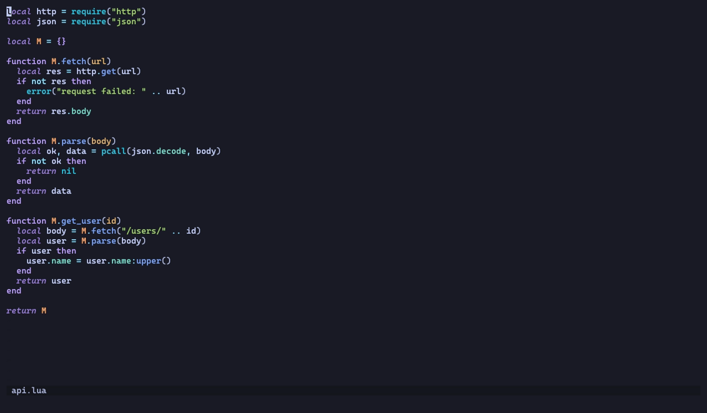

# review.nvim 🧐

Code review annotations for codediff.nvim, optimized for AI feedback loops.

Inspired by [tuicr](https://github.com/agavra/tuicr).


*Reviewing a diff: an issue, a praise and a range suggestion, then `C` to export them as markdown.*

## Features

- Add comments to specific lines in diff view (Note, Suggestion, Issue, Praise)
- Multi-line comment support with box-style virtual text display
- Comments displayed as signs, line highlights, and virtual text
- One comment store per repository, persisted across restarts
- Closing the review exports to the clipboard, then archives and clears the comments
- Export format optimized for AI conversations, with a callback for tmux, agents or files
- Send comments directly to [sidekick.nvim](https://github.com/folke/sidekick.nvim) for AI chat
- Commit picker modal to select specific commits to review
- Branch picker to review a branch against its base (merge-base aware, no checkout needed)
- Notes on any file while you browse, exported alongside review comments
- Built on top of codediff.nvim

## Requirements

- Neovim >= 0.10
- [codediff.nvim](https://github.com/esmuellert/codediff.nvim)
- [nui.nvim](https://github.com/MunifTanjim/nui.nvim)

## Installation

The plugin follows [semantic versioning](https://semver.org/). Pin to a tag if you don't want surprises.

Using lazy.nvim:

```lua
{
  "georgeguimaraes/review.nvim",
  version = "v*",
  dependencies = {
    "esmuellert/codediff.nvim",
    "MunifTanjim/nui.nvim",
  },
  event = "VeryLazy",
  keys = {
    { "<leader>rr", "<cmd>Review<cr>", desc = "Review working tree" },
    { "<leader>rc", "<cmd>Review commits<cr>", desc = "Review commits" },
    { "<leader>rb", "<cmd>Review branch<cr>", desc = "Review branch" },
    { "<leader>rn", ":Review note<cr>", mode = { "n", "v" }, desc = "Review: note here" },
    { "<leader>re", "<cmd>Review edit<cr>", desc = "Review: edit comment" },
    { "<leader>rd", "<cmd>Review delete<cr>", desc = "Review: delete comment" },
    { "<leader>rx", "<cmd>Review export<cr>", desc = "Review: export" },
  },
  opts = {},
}
```

A few notes on that snippet:

- The `keys` all sit under `<leader>r` so they show up together in which-key. Don't map `<leader>r` itself to anything, or Neovim waits for the timeout before running it.
- `<leader>rn` uses `:` on purpose. In visual mode that becomes `:'<,'>Review note`, so the same key does single-line and range notes.
- `event = "VeryLazy"` loads the plugin shortly after startup. That's what makes notes you left earlier appear when you open a file. With `cmd = { "Review" }` instead, nothing renders until you've run `:Review` once in the session, which is fine if you don't use notes.
- Inside the diff view the single-key mappings (`i`, `d`, `e`, `C`, `q`, ...) come from the plugin. See [Keybindings](#keybindings-in-diff-view).

## Usage

```vim
:Review              " Open codediff with comment keymaps (default)
:Review open         " Same as above
:Review commits      " Select commits to review (picker modal)
:Review commits SHA  " Review a single commit (diffs SHA^ against SHA)
:Review commits REV1 REV2  " Review specific revision range (skips picker)
:Review branch       " Pick a branch to review against main/master (current branch first)
:Review branch TARGET [BASE]  " Review TARGET (e.g. origin/feature) against BASE (skips picker)
:Review note         " Comment on the current line of any file (:'<,'>Review note for a range)
:Review edit         " Edit the comment at the cursor
:Review delete       " Delete the comment at the cursor
:Review close        " Close: export to clipboard, then archive and clear comments
:Review export       " Export comments to clipboard
:Review preview      " Preview exported markdown in split
:Review sidekick     " Send comments to sidekick.nvim
:Review list         " List all comments
:Review clear        " Archive and clear all comments
:Review toggle       " Toggle readonly/edit mode
```

## Workflow

`:Review` opens your staged and unstaged changes in a side by side diff, in a new tab with a file panel on the left. `:Review commits` lets you pick specific commits instead. `:Review branch` lists branches to review, with the one you're on first. Reviewing the branch you're on diffs the merge base against your working tree, so uncommitted work counts. Reviewing any other branch (say `origin/feature-x`) diffs commits and doesn't check anything out. The base is `main` or `master` unless you set `branch = { base = "develop" }` or pass it as the second argument.

`<Tab>` and `<S-Tab>` move between files, `f` toggles the file panel, `t` switches between side by side and inline. `<C-w>h` and `<C-w>l` move between the old (left) and new (right) panes. When you see something worth a comment, press `i` on the line and pick a type from the menu (note, suggestion, issue, praise). The comment renders as a box below the line with an icon in the gutter.

For a multi-line comment, select the range visually and press `i`. For a comment about the whole file, press `F`. Comments on the left side only show on the left, and the same goes for the right.

`]n` and `[n` jump between comments, `e` edits one, `d` deletes. `c` lists every comment across files so you can jump to one.

`C` copies the comments to the clipboard as markdown and shows a preview. `q` does the export one more time, archives the comments and closes, so the next review starts empty. Paste the markdown into Claude Code, sidekick.nvim (`S`), or whatever you're talking to. It looks like this:

```
1. **[ISSUE]** `src/api.ts:23` - This endpoint doesn't handle errors
2. **[SUGGESTION]** `src/utils.ts:~10` - The old implementation was cleaner
```

A `~` before the line number means the old (left) side of the diff.

## Notes on any file



*Notes left while reading files, with no diff open. They show up on the review and in the export like any other comment.*

You don't need a diff open to leave a comment. `:Review note` on any line of any file in the repo opens the same popup, and `:'<,'>Review note` does it for a visual selection. Notes render in the buffer while you browse, show up on the diff if you open a review later, and go out in the same export as everything else. `:Review edit` and `:Review delete` work at the cursor in any buffer. There are no default keymaps outside the diff. The [installation](#installation) snippet maps `<leader>rn`, `<leader>re` and `<leader>rd` for these.

Notes follow your edits. They're attached to extmarks while the buffer is open, and the stored line numbers get updated when you write the file, so adding lines above a note keeps it on the same code.

Files are resolved against the git repo of Neovim's working directory. A note on a file from some other repo gets refused.

## How comments are stored

One comment store per repo, under `~/.local/share/nvim/review/` (Neovim's data dir). Comments survive restarts, so you can leave a review half done and pick it up later.

`q` (or `:Review close`) ends a round: it exports, moves the store to `archive/` with a timestamp, and leaves you with an empty one. `C` and `:Review export` only export, so you can check the output midway. `:Review clear` archives too. Archives stick around for 30 days.

Since the store is per repo and not per branch, comments you left on another branch are still there when you open a review somewhere else. review.nvim tells you when that happens ("Comments made on other branches: 2 from feature-x"), and `:Review clear` drops them.

`export = { clear_on_close = false }` keeps comments after closing, which is how versions before 1.10 worked. The first time you run this version, the old per-branch file for your current branch is picked up automatically.

## Keybindings (in diff view)

**Readonly mode** (default):
| Key | Action |
|-----|--------|
| `i` | Add comment (pick type from menu) |
| `d` | Delete comment at cursor |
| `e` | Edit comment at cursor |
| `c` | List all comments |
| `f` | Toggle file panel visibility |
| `R` | Toggle readonly/edit mode |
| `<Tab>` | Next file |
| `<S-Tab>` | Previous file |
| `]n` | Jump to next comment |
| `[n` | Jump to previous comment |
| `C` | Export to clipboard and show preview |
| `S` | Send comments to sidekick.nvim |
| `<C-r>` | Archive and clear all comments |
| `q` | Close: export, then archive and clear comments |
| `t` | Toggle side-by-side/inline layout |
| `g?` | Show codediff help |

**Edit mode** (when `readonly = false`):
| Key | Action |
|-----|--------|
| `<localleader>cc` | Add comment (pick type from menu) |
| `<localleader>cn/cs/ci/cp` | Add Note/Suggestion/Issue/Praise |
| `<localleader>cd` | Delete comment |
| `<localleader>ce` | Edit comment |

**Comment popup** (when adding/editing):
| Key | Action |
|-----|--------|
| `Enter` | Insert newline (multi-line comments supported) |
| `Ctrl+s` | Submit comment |
| `Tab` | Cycle comment type |
| `Esc` / `q` | Cancel (normal mode) |

## Configuration

All keymaps can be set to `false` to disable them.

**Keymap options**
| Option | Default | Action |
|--------|---------|--------|
| `add_comment` | `<localleader>cc` | Add comment, pick type (edit mode) |
| `add_note` | `<localleader>cn` | Add note (edit mode) |
| `add_suggestion` | `<localleader>cs` | Add suggestion (edit mode) |
| `add_issue` | `<localleader>ci` | Add issue (edit mode) |
| `add_praise` | `<localleader>cp` | Add praise (edit mode) |
| `delete_comment` | `<localleader>cd` | Delete comment (edit mode) |
| `edit_comment` | `<localleader>ce` | Edit comment (edit mode) |
| `next_comment` | `]n` | Next comment |
| `prev_comment` | `[n` | Previous comment |
| `next_file` | `<Tab>` | Next file |
| `prev_file` | `<S-Tab>` | Previous file |
| `toggle_file_panel` | `f` | Toggle file panel |
| `list_comments` | `c` | List all comments |
| `export_clipboard` | `C` | Export to clipboard |
| `send_sidekick` | `S` | Send comments to sidekick |
| `clear_comments` | `<C-r>` | Archive and clear all comments |
| `close` | `q` | Close: export, archive and clear |
| `toggle_readonly` | `R` | Toggle readonly/edit mode |
| `readonly_add` | `i` | Add comment (readonly mode) |
| `readonly_delete` | `d` | Delete comment (readonly mode) |
| `readonly_edit` | `e` | Edit comment (readonly mode) |
| `popup_submit` | `<C-s>` | Submit comment (popup, insert & normal) |
| `popup_cancel` | `q` | Cancel comment (popup, normal mode) |
| `popup_cycle_type` | `<Tab>` | Cycle comment type (popup) |

**Other options**
| Option | Default | Meaning |
|--------|---------|---------|
| `codediff.readonly` | `true` | Diff panes are read-only, with the single-key mappings above |
| `branch.base` | `nil` | Base for `:Review branch`; `nil` picks `origin/HEAD`, then `main` or `master` |
| `export.clipboard` | `true` | Copy exported markdown to the `+` and `*` registers |
| `export.on_export` | `nil` | `function(markdown, comments)` run on every export |
| `export.clear_on_close` | `true` | `q` archives and clears comments after exporting |

```lua
require("review").setup({
  comment_types = {
    note = { key = "n", name = "Note", icon = "📝", hl = "ReviewNote" },
    suggestion = { key = "s", name = "Suggestion", icon = "💡", hl = "ReviewSuggestion" },
    issue = { key = "i", name = "Issue", icon = "⚠️", hl = "ReviewIssue" },
    praise = { key = "p", name = "Praise", icon = "✨", hl = "ReviewPraise" },
  },
  keymaps = {
    add_note = "<localleader>cn",
    add_suggestion = "<localleader>cs",
    add_issue = "<localleader>ci",
    add_praise = "<localleader>cp",
    delete_comment = "<localleader>cd",
    edit_comment = "<localleader>ce",
    next_comment = "]n",
    prev_comment = "[n",
    toggle_file_panel = "f",
  },
  codediff = {
    readonly = true,
  },
  branch = {
    base = "main",
  },
  export = {
    clipboard = true,
    on_export = nil,
    clear_on_close = true,
  },
})
```

## Export Format

Comments come out as markdown meant to be pasted into an AI chat:

```markdown
I reviewed your code and have the following comments. Please address them.

Comment types: ISSUE (problems to fix), SUGGESTION (improvements), NOTE (observations), PRAISE (positive feedback)

1. **[ISSUE]** `src/components/Button.tsx:23` - Wrapping onClick creates a new function every render
2. **[SUGGESTION]** `src/utils/api.ts:~45` - The old implementation was cleaner
3. **[PRAISE]** `src/hooks/useAuth.ts:12-18` - Clean implementation of the auth flow
```

Lines prefixed with `~` (e.g. `:~45`) refer to the old (left) side of the diff. Range comments use `start-end` notation.

## Export targets

Every export (`C`, `:Review export`, and `q` on close) copies the markdown to the clipboard and calls `export.on_export` if you set one. That's where you hook up a tmux pane, a file an agent watches, Avante, or anything else.

```lua
require("review").setup({
  export = {
    clipboard = true,
    on_export = function(markdown, comments)
      -- send it to the pane on the right
      vim.fn.system({ "tmux", "send-keys", "-t", "right", markdown, "Enter" })
    end,
  },
})
```

`comments` is the list of comment tables (`file`, `line`, `line_end`, `side`, `type`, `text`) in case you want your own format.

## Health check

`:checkhealth review` checks Neovim, git, codediff.nvim, nui.nvim and the clipboard. It also probes the codediff functions review.nvim calls, so a version mismatch between the two shows up there and not as an error on `:Review`.

## Running Tests

Tests use [mini.test](https://github.com/nvim-mini/mini.test). Dependencies get cloned into `deps/` on first run.

```bash
make test        # unit tests (tests/test_*.lua)
make test-e2e    # end-to-end: drives :Review in a child Neovim with real codediff.nvim + nui.nvim
make test-all    # both
make test-file FILE=tests/test_store.lua
```

The end-to-end tests compare screenshots against `tests/e2e/screenshots/`. If a UI change is on purpose, delete the affected screenshot and run again to regenerate it.

## License

Copyright 2025 George Guimarães

Licensed under the Apache License, Version 2.0. See [LICENSE](LICENSE) for details.
